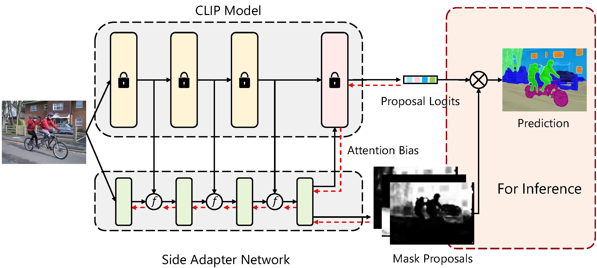

# [CVPR2023-Highlight] Side Adapter Network for Open-Vocabulary Semantic Segmentation

This is the official implementation of our conference paper : "[Side Adapter Network for Open-Vocabulary Semantic Segmentation](https://arxiv.org/abs/2302.12242)".


## Introduction

This paper presents a new framework for open-vocabulary semantic segmentation with the pre-trained vision-language model, named Side Adapter Network (SAN). Our approach models the semantic segmentation task as a region recognition problem. A side network is attached to a frozen CLIP model with two branches: one for predicting mask proposals, and the other for predicting attention bias which is applied in the CLIP model to recognize the class of masks. This decoupled design has the benefit CLIP in recognizing the class of mask proposals. Since the attached side network can reuse CLIP features, it can be very light. In addition, the entire network can be trained end-to-end, allowing the side network to be adapted to the frozen CLIP model, which makes the predicted mask proposals CLIP-aware.
Our approach is fast, accurate, and only adds a few additional trainable parameters. We evaluate our approach on multiple semantic segmentation benchmarks. Our method significantly outperforms other counterparts, with up to 18 times fewer trainable parameters and 19 times faster inference speed. 

### Tab of Content
- [Demo](#6)
- [Installation](#1)
- [Data Preparation](#2)
- [Usage](#3)
  - [Training](#5)
  - [Evaluation](#4)
  <!-- - [Visualization](#5) -->

<span id="6"></span>

### Demo
- Run the demo app on [🤗HuggingFace](https://huggingface.co/spaces/Mendel192/SAN-Demo). (It is running on a low-spec machine and could be slow)
- Run the demo app with docker.
  ```
  docker build docker/app.Docker -t san_app
  docker run -it --shm-size 4G -p 7860:7860  san_app 
  ```
<span id="1"></span>

### Installation
1. Clone the repository
    ```sh
    git clone https://github.com/MendelXu/SAN.git
    ```
2. Navigate to the project directory
    ```sh
    cd SAN
    ```
3. Install the dependencies
    ```sh
    bash install.sh
    ```
   **Hint**: You can run the job in the docker instead of installing dependencies locally.
  Run with pre-built docker:
    ```
    docker run -it --gpus all --shm-size 8G mendelxu/pytorch:d2_nvcr_2008 /bin/bash
    ```
    or build your docker with provided dockerfile `docker/Dcokerfile`.

<span id="2"></span>

### Data Preparation
See [SimSeg](https://github.com/MendelXu/zsseg.baseline) for reference. The data should be organized like:
```
datasets/
    coco/
        ...
        train2017/
        val2017/
        stuffthingmaps_detectron2/
    VOC2012/
        ...
        images_detectron2/
        annotations_detectron2/
    pcontext/
        ...
        val/
    pcontext_full/
        ...
        val/
    ADEChallengeData2016/
        ...
        images/
        annotations_detectron2/
    ADE20K_2021_17_01/
        ...
        images/
        annotations_detectron2/        
```
<span id="3"></span>

### Usage


- #### Pretrained Weights

  |Model|Config |Weights|Logs|
  |-----|-------|---|---|
  |SAN-ViT-B/16|configs/san_clip_vit_res4_coco.yaml |[Huggingface](https://huggingface.co/Mendel192/san/blob/main/san_vit_b_16.pth) |[Log](resources/san_vit_b_16.log)  | 
  |SAN-ViT-L/14|configs/san_clip_vit_large_res4_coco.yaml |[Huggingface](https://huggingface.co/Mendel192/san/blob/main/san_vit_large_14.pth) |[Log](resources/san_vit_large_14.log)|


- #### Evaluation 

  <span id="4"></span>
  - evaluate trained model on validation sets of all datasets.
  ```sh
  python train_net.py --eval-only --config-file <CONFIG_FILE> --num-gpus <NUM_GPU> OUTPUT_DIR <OUTPUT_PATH> MODEL.WEIGHTS <TRAINED_MODEL_PATH>
  ```
   For example, evaluate our pre-trained model:
  ```
  # 1. Download SAN (ViT-B/16 CLIP) from https://huggingface.co/Mendel192/san/blob/main/san_vit_b_16.pth.
  # 2. put it at `output/model.pth`.
  # 3. evaluation
    python train_net.py --eval-only --config-file configs/san_clip_vit_res4_coco.yaml --num-gpus 8 OUTPUT_DIR ./output/trained_vit_b16 MODEL.WEIGHTS output/model.pth
  ```
  - evaluate trained model on validation sets of one dataset.
  ```sh
  python train_net.py --eval-only --config-file <CONFIG_FILE> --num-gpus <NUM_GPU> OUTPUT_DIR <OUTPUT_PATH> MODEL.WEIGHTS <TRAINED_MODEL_PATH> DATASETS.TEST "('<FILL_DATASET_NAME_HERE>',)"
  ```
<span id="5"></span>
- #### Training
  
    ```sh
    wandb off
    # [Optional] If you want to log the training logs to wandb.
    # wandb login
    # wandb on
    python train_net.py --config-file <CONFIG_FILE> --num-gpus <NUM_GPU> OUTPUT_DIR <OUTPUT_PATH> WANDB.NAME <WANDB_LOG_NAME>
    ```
  **Hint**: We use `<>` to denote the variables you should replace according to your own setting.
  
### TODO
  - Add detailed description of the dataset preparation process.
  - Transfer and test cross attention implementation.
  - Add support to flash attention.

### License
Distributed under the MIT License. See LICENSE for more information.

### Cite 

If you find it helpful, you can cite our paper in your work.

```
@proceedings{xu2023side,
  title={Side Adapter Network for Open-Vocabulary Semantic Segmentation},
  author={Mengde Xu, Zheng Zhang, Fangyun Wei, Han Hu, Xiang Bai},
  journal={CVPR},
  year={2023}
}
```


